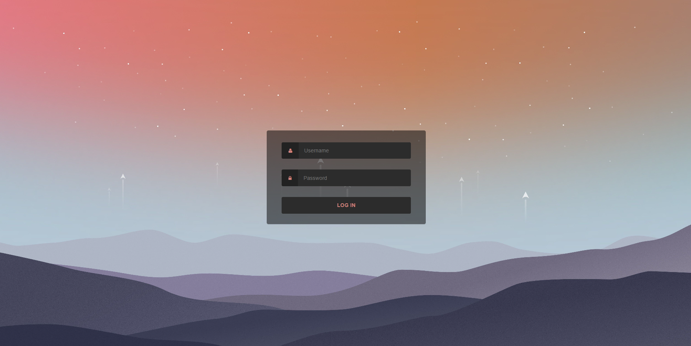
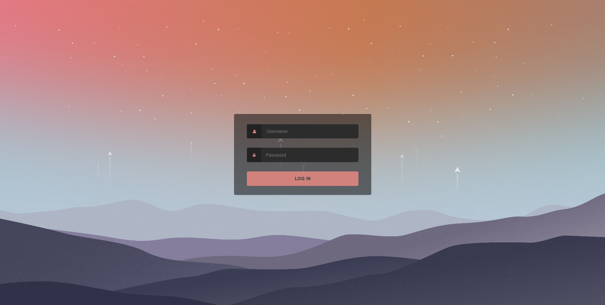
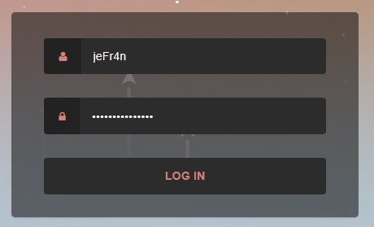

# My React Login Project

This is a React-based login project with a minimalist design and muted colors. The goal of this project is to provide an attractive and functional login page for web applications.

## Screenshots

  
  Screen 1: Login page.
  
  Screen 2: Login page : focus.
  
  Screen 3: Login page : box.

## Features

- Minimalist design with muted colors.
- Login form with field validation.

## Technologies Used

- React: A JavaScript library for building user interfaces.
- CSS: Custom styles for the minimalist design.

## How to Use

1. Clone this repository on your local machine:

`git clone https://github.com/jeFr4n/Login.git`

2. Navigate to the project directory:

`cd my-react-login-project`

3. Install the dependencies:

`npm install`

4. Start the application:

`npm start`

---

The application will run at [http://localhost:3000](http://localhost:3000).

## Customization

If you wish to customize the design or add additional features, you can modify the CSS files or add components as needed.

## Contribution

If you'd like to contribute to this project, I'd be delighted to receive your contributions! Feel free to open an issue or submit a pull request.

---

I hope you enjoy working on your React login project! If you have any questions or need further assistance, please don't hesitate to reach out.

Happy coding! 🚀

